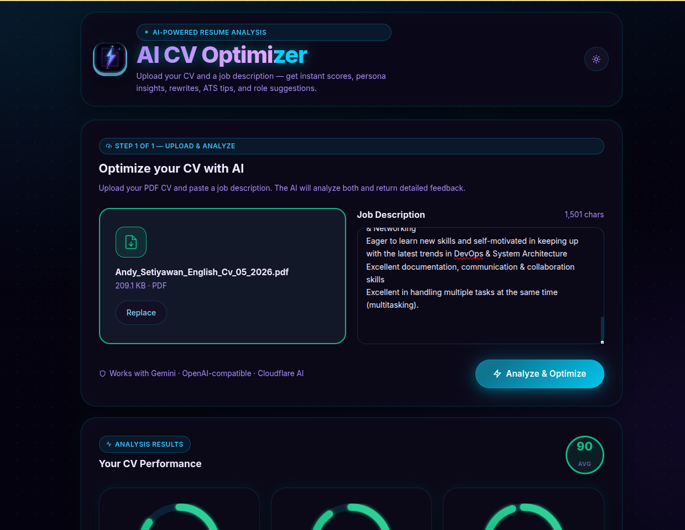
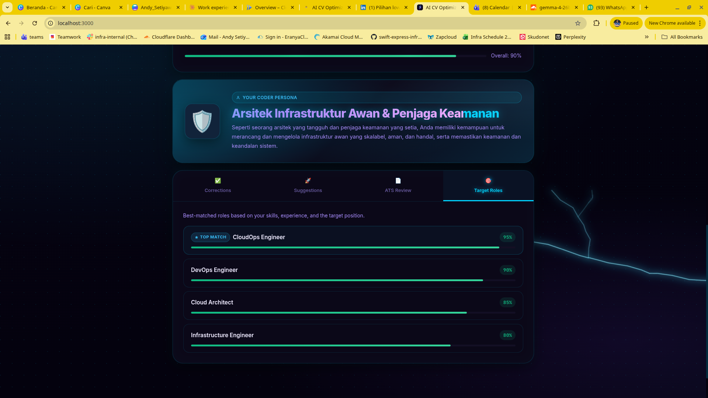

<div align="center">


# AI CV Optimizer

**AI-powered resume analysis with electric lightning aesthetics**

Upload your CV and a job description — get instant scores, persona insights,  
AI rewrites, ATS feedback, and targeted role suggestions.

[](https://kit.svelte.dev)
[](https://svelte.dev)
[](https://www.typescriptlang.org)
[](https://pnpm.io)
[](https://nodejs.org)

</div>

---

## ✨ Screenshots

### Upload & Analyze



### Analysis Results



---

## 🚀 Features

| Feature | Description |
|---------|-------------|
| 📊 **Score Gauges** | Animated SVG arcs for CV Match, ATS Score, and Role Fit (0–100) |
| 🧠 **Coder Persona** | AI assigns a unique persona with name, emoji, and description |
| ✍️ **AI Rewrites** | Optimized professional summary and work experience sections |
| ⚠️ **ATS Feedback** | Missing keywords and formatting issues detected |
| 🎯 **Role Suggestions** | Target role + alternatives ranked by match score |
| ⚡ **Lightning UI** | Canvas-based electric lightning animation — runs continuously |
| 🌑 **Dark Mode** | Electric dark-first design; toggle to light at any time |
| 📱 **Responsive** | Works on all screen sizes from 320 px up |
| 🤖 **Multi-Provider AI** | Gemini · OpenAI-compatible · Cloudflare Workers AI |

---

## 🛠 Tech Stack

| Layer | Technology |
|-------|-----------|
| **Framework** | SvelteKit 2 + Svelte 5 (runes: `$state`, `$derived`, `$effect`, `$props`) |
| **Styling** | Vanilla CSS + design tokens — no Tailwind |
| **UI Effect** | Canvas lightning engine — recursive midpoint-displacement, sparks, aurora |
| **Logo** | SVG — document + lightning bolt, cyan-to-violet gradient |
| **PDF Parsing** | `pdf-parse` (server-side, Node.js) |
| **AI Providers** | Google Gemini · OpenAI-compatible · Cloudflare Workers AI |
| **Package Manager** | pnpm |
| **Production** | `@sveltejs/adapter-node` |

---

## ⚡ Quick Start

```bash
# 1. Clone and install
git clone <your-repo-url>
cd AI-CV-Optimizer
pnpm install

# 2. Configure your AI provider
cp .env.example .env
# Edit .env — see Provider Setup below

# 3. Start
pnpm dev
# → http://localhost:5173
```

---

## 🤖 Provider Setup

Only one provider section needs to be configured in `.env`.

### Option A — Google Gemini *(recommended)*

```env
AI_PROVIDER=gemini
GOOGLE_API_KEY=your_key_here
GOOGLE_MODEL_NAME=gemini-2.5-flash
```

> Get your key at [aistudio.google.com](https://aistudio.google.com/app/apikey)

---

### Option B — OpenAI-compatible *(Ollama / Groq / LM Studio / OpenAI)*

```env
AI_PROVIDER=openai
OPENAI_BASE_URL=http://localhost:11434/v1
OPENAI_API_KEY=ollama
OPENAI_MODEL_NAME=llama3.1
```

> Works with any OpenAI-compatible server — local or cloud.

---

### Option C — Cloudflare Workers AI *(free tier)*

```env
AI_PROVIDER=cloudflare
CF_ACCOUNT_ID=your_account_id
CF_API_TOKEN=your_api_token
CF_MODEL_NAME=@cf/meta/llama-3.1-8b-instruct
```

> [!IMPORTANT]
> Only use **valid** Cloudflare model names. Invalid models return HTML instead of JSON.

| Model | Speed | Notes |
|-------|-------|-------|
| `@cf/meta/llama-3.1-8b-instruct` | ⚡ Fast | Recommended for free tier |
| `@cf/meta/llama-3.1-70b-instruct` | 🐢 Slow | Best quality |
| `@cf/mistral/mistral-7b-instruct-v0.2` | ⚡ Fast | Good alternative |
| `@cf/google/gemma-7b-it` | ⚡ Fast | Google Gemma |

---

### Optional Settings

```env
LLM_TEMPERATURE=0.8    # 0.0 – 1.0 (lower = more deterministic)
LLM_MAX_TOKENS=8192    # Max output tokens
```

---

## 📋 Commands

| Command | Description |
|---------|-------------|
| `pnpm dev` | Start dev server → `http://localhost:5173` |
| `pnpm build` | Production build → `build/` |
| `pnpm start` | Run production server (loads `.env`) |
| `pnpm lint` | Svelte + TypeScript type check (0 errors, 0 warnings) |
| `pnpm check` | Same as lint |

---

## 📁 Project Structure

```
AI-CV-Optimizer/
├── src/
│   ├── app.html                        # HTML shell — dark default, SVG favicon
│   ├── app.css                         # Design tokens + electric CSS additions
│   ├── routes/
│   │   ├── +layout.svelte              # Lightning + Header + Footer
│   │   ├── +page.svelte                # Upload form + results display
│   │   └── api/analyze/+server.ts      # POST /api/analyze — always returns JSON
│   └── lib/
│       ├── components/
│       │   ├── Lightning.svelte        # ⚡ Canvas lightning engine
│       │   ├── Header.svelte           # Logo, gradient title, theme toggle
│       │   ├── UploadForm.svelte       # Drag-drop PDF + job description
│       │   ├── ScoreBoard.svelte       # 3 animated score gauges
│       │   ├── ScoreGauge.svelte       # SVG arc + count-up animation
│       │   ├── PersonaCard.svelte      # Aurora bg, emoji, gradient name
│       │   ├── ResultTabs.svelte       # 4-tab result panel
│       │   ├── Tab*.svelte             # Corrections / Suggestions / ATS / Roles
│       │   ├── SkeletonLoader.svelte   # Shimmer skeleton during AI processing
│       │   └── Footer.svelte
│       ├── server/
│       │   ├── prompt.ts               # Shared AI prompt + JSON schema
│       │   ├── pdf.ts                  # PDF text extraction
│       │   └── providers/
│       │       ├── base.ts             # AIProvider interface
│       │       ├── index.ts            # Provider factory
│       │       ├── gemini.ts           # Google Gemini
│       │       ├── openai.ts           # OpenAI-compatible
│       │       └── cloudflare.ts       # Cloudflare Workers AI
│       ├── stores/theme.ts             # Dark/light mode store
│       ├── types/analysis.ts           # TypeScript types
│       └── utils/clipboard.ts          # Copy to clipboard
├── static/
│   ├── logo.svg                        # ⚡ SVG app icon
│   └── logo.png                        # PNG fallback
├── screenshoot.png                     # Upload form screenshot
├── screenshoot_results.png             # Results view screenshot
├── .env                                # Active config (git-ignored)
├── .env.example                        # Config template
├── PRD.md                              # Product requirements
├── OPENCODE_PROMPT.md                  # AI agent prompt for future changes
└── OPENCODE_REFACTORING_GUIDE.md       # Architecture + troubleshooting guide
```

---

## 🔌 API Reference

### `POST /api/analyze`

**Request** — `multipart/form-data`

| Field | Type | Limit | Description |
|-------|------|-------|-------------|
| `cv_file` | PDF file | 10 MB | Candidate CV |
| `job_description` | string | — | Target job description |

**Response** — always `application/json`

```jsonc
// Success — HTTP 200
{
  "match_score": 92,
  "ats_score": 88,
  "role_fit_score": 90,
  "persona_name": "The Cloud Architect",
  "persona_emoji": "🧠",
  "persona_description": "...",
  "corrected_cv_summary": "...",
  "corrected_cv_experience": "...",
  "correction_feedback": "...",
  "optimization_suggestions": ["...", "..."],
  "ats_suggestions": ["...", "..."],
  "suggested_job_roles": [{ "role": "DevOps Engineer", "score": 94 }]
}

// Error — HTTP 400 / 422 / 500
{ "error": true, "message": "Descriptive error message" }
```

---

## 🐛 Troubleshooting

<details>
<summary><strong>Cloudflare returns "Cross-site..." or non-JSON error</strong></summary>

Your `CF_MODEL_NAME` is invalid. Cloudflare returns an HTML error page for unknown models.

Use a valid model:
```env
CF_MODEL_NAME=@cf/meta/llama-3.1-8b-instruct
```

Check the full list at [developers.cloudflare.com/workers-ai/models](https://developers.cloudflare.com/workers-ai/models/)
</details>

<details>
<summary><strong>Ollama connection refused</strong></summary>

```bash
ollama serve                    # make sure it's running
ollama pull llama3.1            # pull the model
```

Set in `.env`:
```env
OPENAI_BASE_URL=http://localhost:11434/v1   # no trailing slash
```
</details>

<details>
<summary><strong>Lightning animation stops</strong></summary>

The canvas loop is wrapped in `try/catch` — it should never stop. If it does, refresh the page. If it consistently fails, check the browser console for WebGL/canvas errors.
</details>

<details>
<summary><strong>PDF text not extracted</strong></summary>

`pdf-parse` only works with **text-based PDFs**. Scanned PDFs (images) will return empty text. Use a PDF that was exported from a word processor.
</details>

<details>
<summary><strong>Model doesn't return valid JSON</strong></summary>

Try lowering temperature:
```env
LLM_TEMPERATURE=0.3
```

Or switch to a larger/smarter model. The `parseAnalysisJSON` helper automatically strips markdown code fences.
</details>

---

## 📄 License

MIT © [Andy Setiyawan](https://www.linkedin.com/in/andy-setiyawan-452396170/)

---

<div align="center">

Made with ⚡ by Andy Setiyawan

[](https://www.linkedin.com/in/andy-setiyawan-452396170/)

</div>
